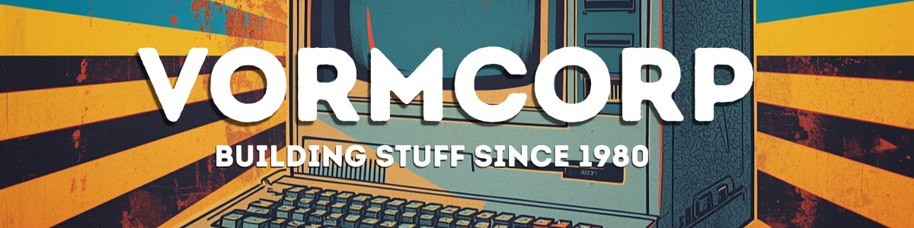

  

# Think Like a Computer

## Micro:bit & Computational Thinking — 10-Lesson Course

A complete, open-source course for Year 7–8 students (age ~13) with no prior coding experience.

This course is likely to be 2-3 weeks if students timetabled for 3hrs per week. The lessons are intended to be 40 mins, however this means getting a hussle on. 60 minute lessons are more likely allowing for set up and pack up time.

**This is a FREE course** but you can support this and other courses for the price of a coffee

  

**Built for NSW schools implementing the Technology 7–8 Syllabus (2023) from 2026.**

---

## What's in This Course

- **10 lessons** × 40 minutes each
- Uses the BBC micro:bit (V1 and V2 both supported)
- Coding in **MicroPython** via the online [Python Editor](https://python.microbit.org/v/3)
- **No installation required** — fully browser-based, works on school computers
- Student-facing language written for 13-year-olds with no prior experience
- Built on **Biggs SOLO Taxonomy** — difficulty increases deliberately lesson by lesson
- **Progress log** in every lesson for formative evidence
- **IPO framework** (Input → Process → Output) threads through all lessons

---

## NSW Curriculum Alignment

| Outcome              | Description                                                                    |
| -------------------- | ------------------------------------------------------------------------------ |
| **TE4-DIG-01** | Demonstrates technological literacy to safely interact in digital environments |
| **TE4-DIG-02** | Uses data and digital systems to code, design and produce projects             |
| TE4-PPM-01           | Applies processes in planning, management and production of projects           |
| TE4-DES-01           | Communicates and evaluates design ideas and solutions                          |

---

## The 10 Lessons

| #                       | Title                        | CT Pillar           | SOLO Level        |
| ----------------------- | ---------------------------- | ------------------- | ----------------- |
| [1](lessons/lesson-01.md)  | What Is a Computer Thinking? | Decomposition       | Uni-structural    |
| [2](lessons/lesson-02.md)  | Hello, micro:bit!            | Algorithm Design    | Uni-structural    |
| [3](lessons/lesson-03.md)  | Making Decisions             | Pattern Recognition | Multi-structural  |
| [4](lessons/lesson-04.md)  | Repeat Yourself              | Pattern Recognition | Multi-structural  |
| [5](lessons/lesson-05.md)  | Talking to the World         | Abstraction         | Relational        |
| [6](lessons/lesson-06.md)  | Sensing the World            | Decomposition       | Relational        |
| [7](lessons/lesson-07.md)  | Build a Mini-Game            | All four            | Relational        |
| [8](lessons/lesson-08.md)  | Fixing What's Broken         | Abstraction         | Extended Abstract |
| [9](lessons/lesson-09.md)  | Design Your Own              | All four            | Extended Abstract |
| [10](lessons/lesson-10.md) | Show What You Know           | All four            | Extended Abstract |

---

## Pedagogical Framework & Literature Review

This course deliberately rejects the modern "tool-first" trend in digital technologies education. It is built on foundational educational research establishing that computer science instruction must prioritize structural cognitive logic over superficial syntax memorization.

### 1. Cognitive Load Theory: Why "Tool-First" Modernism Fails
A major point of friction in secondary school robotics and coding is the premature introduction of complex syntax or finicky physical computing components (e.g., raw breadboards, jumpers, and dense C++ syntax). 

* **The Research:** Sweller’s **Cognitive Load Theory (CLT)** demonstrates that a novice learner’s working memory is extremely limited. When a 13-year-old student spends an entire 40-minute lesson troubleshooting loose wires, broken hardware, or missing semicolons, their *germane cognitive load* (the mental bandwidth used to process and integrate new schemas) drops to zero.
* **My Approach:** By isolating the programming environment to browser-based **MicroPython** via the online editor and utilizing highly integrated BBC micro:bit hardware (or its native simulator), we strip away extraneous cognitive noise. Students focus 100% of their mental energy on core logical problems, not environmental frustration.

### 2. The Four Pillars of Computational Thinking
We treat coding not as an isolated vocational skill, but as an analytical toolset. This framework builds upon Jeannette Wing’s seminal research on **Computational Thinking (CT)**, which redefines computer science as a universally applicable problem-solving methodology. 

Rather than memorizing arbitrary code commands, students systematically attack problems using the four structural pillars across all 10 lessons:
* **Decomposition:** Learning to break down complex, multi-layered digital problems into bite-sized, isolated tasks.
* **Pattern Recognition:** Spotting loops, logic structures, and recurring conditions to optimize code efficiency.
* **Abstraction:** Stripping away background noise to focus purely on the critical inputs and data paths.
* **Algorithm Design:** Crafting ironclad, step-by-step instructions (the Input-Process-Output loop) to achieve a predictable outcome.

### 3. Measuring Progression: Biggs’ SOLO Taxonomy vs. Bloom
While most school curricula blindly lean on Bloom’s Taxonomy, this course is systematically mapped to Biggs and Collis' **SOLO Taxonomy (Structure of Observing Learning Outcomes)**. Bloom treats knowledge abstractly; SOLO measures the explicit *structural complexity* of a learner's output.

## Quick Setup

1. Clone or download this repository
2. Share lesson files with students (or host on GitHub Pages — see teacher guide)
3. Ensure `python.microbit.org/v/3` is accessible on your school network
4. One micro:bit per student or pair (or use the simulator — no hardware required)

---

## License

MIT License — free to use, adapt, and share. Please keep the NSW curriculum alignment notes accurate if you modify.

---

*Created for NSW Technology 7–8 (2023) | Implementation from 2026*
